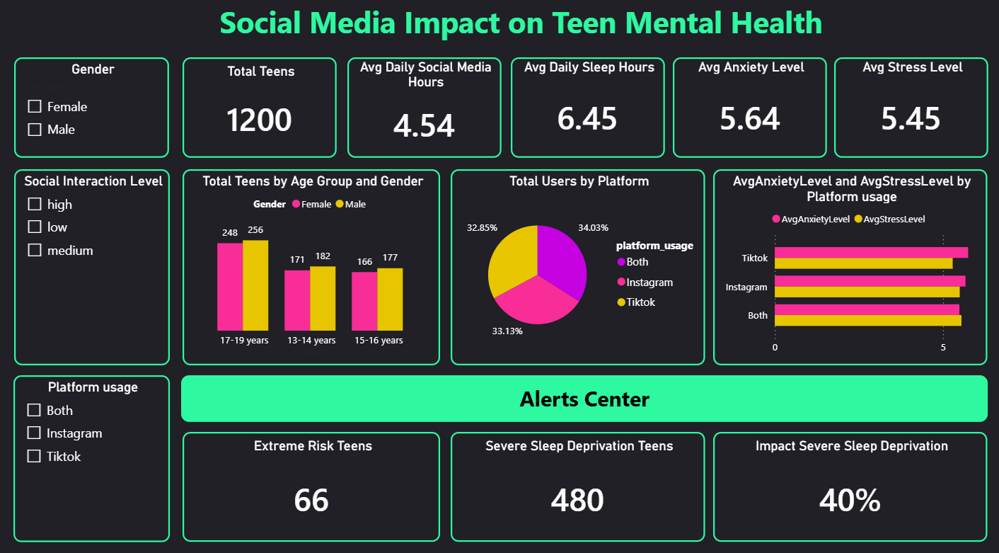

# 📱 Social Media Impact on Teen Mental Health Analytics Dashboard

An end-to-end Data Engineering and Business Intelligence solution designed to analyze, monitor, and identify risk factors in adolescent mental health correlated with social media exposure. 

This project features a robust dimensional model implemented in SQL Server and an advanced interactive Power BI dashboard styled with a high-contrast **Neon Dark Mode** interface for optimized KPI consumption.

---

## 🛠️ Project Architecture & Data Modeling

The data warehouse architecture was structured following a 3-stage data modeling methodology to ensure maximum performance and logical scaling:

1.  **Conceptual Model:** Aligned mental health indicators (anxiety, depression, sleep deprivation, academic degradation) with digital exposure metrics.
2.  **Logical & Physical Model (Star Schema):** Normalized and structured the dataset within **SQL Server** into a highly optimized Star Schema. It features a central fact table (`Fact_Mental_Health_Impact`) connected to independent dimensions representing demographic profiles, temporal attributes, and social media platforms.
3.  **Analytical Layer (Power BI & DAX):** Implemented an analytical context-aware measurement framework using advanced DAX equations, optimizing row-level filtering operations.

---

## 🧠 Strategic Risk Alerts Framework (DAX)

To automate risk detection, the system calculates relative impact rates across the population (`TotalTeens`), scaling metrics from raw volume counts to dynamic analytical proportions.

### 1. Sleep Deprivation Alert (`Sleep Deprivation`)
Identifies cases where screen usage reduces daily rest below the critical healthy threshold (< 6 hours).
```dax
SevereSleepDeprivationTeens = 
CALCULATE(
    COUNTROWS('Fact_Mental_Health_Impact'),
    'Fact_Mental_Health_Impact'[daily_sleep_hours] < 6
)
```
---

## 📑 Appendix: Operational Alert Definitions & DAX Reference

This section provides an analytical breakdown of the thresholds, business logic, and exact DAX implementations used to trigger the real-time alerting framework within the reporting layer.

### Detailed Metric Glossary

| Alert Name | Primary Dimension Trigger | Operational Threshold | Clinical/Analytical Intent |
| :--- | :--- | :--- | :--- |
| **Severe Sleep Deprivation** | `daily_sleep_hours` | Less than 6 hours / day | Isolates cases where high nighttime screen exposure directly correlates with critical sleep debt. |
| **Extreme Risk Indicator** | Multi-variable Concurrency | Screen time > 5 hours, Sleep < 6 hours, Anxiety $\ge$ 8/10 | The primary "Red Flag" metric. Identifies highly vulnerable individuals experiencing full behavioral degradation. |
| **Digital Isolation & Alienation**| `daily_social_media_hours` & `depression_level` | Screen time > 5 hours AND Depression $\ge$ 7/10 | Detects substitution behavior where physical social frameworks are entirely replaced by digital environments. |

### Complete DAX Codebase

```dax
/* ===========================================================================
   CENTRALIZED MEASURES INVENTORY: RISK SYSTEM ALERTS
   ===========================================================================
*/

// Baseline Population Count
TotalTeens = COUNTROWS('Fact_Mental_Health_Impact')

// 1. Sleep Deprivation
SevereSleepDeprivationTeens = 
CALCULATE(
    COUNTROWS('Fact_Mental_Health_Impact'),
    'Fact_Mental_Health_Impact'[daily_sleep_hours] < 6
)

PctSevereSleepDeprivation = 
DIVIDE([SevereSleepDeprivationTeens], [TotalTeens], 0)

// 2. Extreme Risk (Red Flag)
ExtremeRiskTeens = 
CALCULATE(
    COUNTROWS('Fact_Mental_Health_Impact'),
    'Fact_Mental_Health_Impact'[daily_social_media_hours] > 5,
    'Fact_Mental_Health_Impact'[daily_sleep_hours] < 6,
    'Fact_Mental_Health_Impact'[anxiety_level] >= 8
)

PctExtremeRisk = 
DIVIDE([ExtremeRiskTeens], [TotalTeens], 0)


// 3. Social Isolation & Alienation
SocialIsolationTeens = 
CALCULATE(
    COUNTROWS('Fact_Mental_Health_Impact'),
    'Fact_Mental_Health_Impact'[daily_social_media_hours] > 5,
    'Fact_Mental_Health_Impact'[depression_level] >= 7
)

PctSocialIsolation = 
DIVIDE([SocialIsolationTeens], [TotalTeens], 0)
```

## 📊 Key Insights & Analytical Findings

### 1. The Screen Time vs. Sleep Deprivation Correlation
* **The Threshold Factor:** A critical tipping point is observed when adolescents exceed 5 hours of daily social media exposure. Data reveals a direct negative correlation with rest patterns, heavily driving down sleep duration to under 6 hours per day.
* **Behavioral Catalyst:** This widespread sleep debt is strongly tied to late-night screen usage, serving as one of the primary entry points into heightened mental health vulnerabilities.

### 2. Digital Alienation & Social Isolation
* **Real-World Substitution:** There is a distinct segment of youth replacing physical social interactions with digital environments.
* **The Vulnerability Window:** Adolescents crossing the 20% threshold on the Social Isolation Index exhibit a severe overlap between extensive screen dependency and critical indicators of loneliness or depressive symptoms ($\ge$ 7 on a 1-10 scale).

### 3. Amplified Academic Risk
* **Performance Impact:** High social media saturation (over 4 hours daily) acts as a severe disruptor to cognitive and academic focus.
* **The Alarm Signal:** A significant volume of evaluated teens experience a noticeable drop in school performance and grading metrics directly linked to their online exposure habits.

### 4. The "Red Flag" Trifecta (Extreme Risk Profiles)
* **Concurrent Triggers:** The ultimate risk scenario emerges when multiple stressors converge simultaneously: heavy social media usage (>5 hours), severe sleep deprivation (<6 hours), and peak anxiety/stress levels ($\ge$8).
* **Clinical Urgency:** Platforms or demographic clusters that hit these compound conditions present an immediate need for operational awareness or targeted psychological intervention, standing out clearly via conditional visual formatting.

### 5. Platform & Demographic Divergence
* **Platform Risk Variance:** The data highlights stark behavioral differences depending on the platform medium. Highly immersive, algorithm-driven video platforms show a significantly higher probability of pushing teenagers into emotional risk zones compared to more passive, curation-oriented networks.
* **Age-Group Intensification:** Vulnerability factors do not remain static across adolescence; metrics indicate that emotional distress and exposure risks intensify noticeably by up to 15% in older teens (16–18 years old) compared to early-stage adolescents (13–15 years old).

## Dashboard in Power BI


